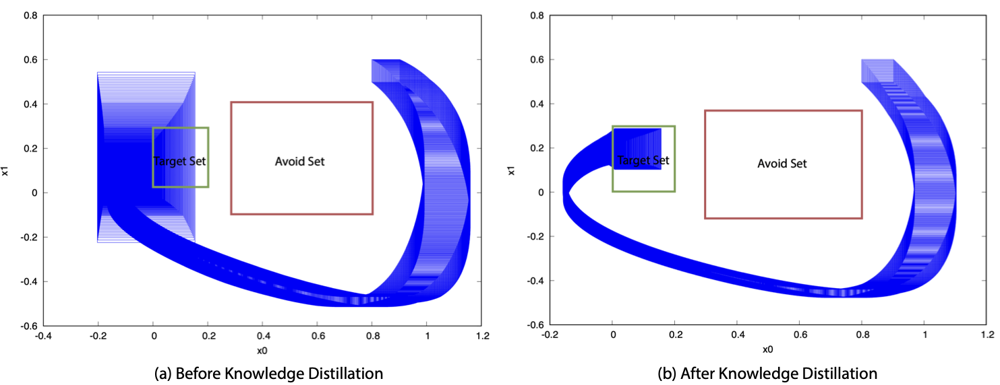
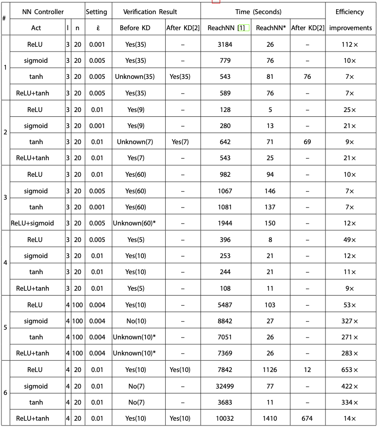

# ReachNN*
ReachNN* is a reachability analysis approach based on Bernstein
polynomials that can verify neural-network controlled systems (NNCSs)
with a more general form of activation functions. We further explore how
certain property, like Lipschitz constant, of the network influences the
verification result and propose a new Verification-aware Knowledge
Distillation method to distill a new neural network controller that is
more verification-friendly and retain the knowledge from the orignal
nerual network controller.

ReachNN* is a GPU implementation of the original proposed ReachNN tool
and integrate the function of Verification-aware Knwoledge
Distillation. We achieved at least 7X faster verification running time
compared to the original ReachNN tool.

## Execution on VM

ReachNN* can be tested in [Virtual
Machine](https://drive.google.com/file/d/1PzHcbV8QnmqksN180BWLgcH04wQB_Tf9/view?usp=sharing), please download it and
import the .ova file using Oracle VM Virtual Box.

We have tested our code with RAM memory size 3072 MB. In the home directory, credential.txt includes the information about account and passcode. readme.txt contains the instruction to test our tool. how_to_share_with_desktop.txt is the instruction about file sharing between virtual machine and your desktop.

We note that since VM does not support GPU usage and have limited RAM memory, the runtime result could be different from what we report.

## Installation

Please skip this step if you are using our tool in the provided VM.

#### System Requirements
Ubuntu 18.04, Python 3.6

#### Up-to-date Installation
- Install dependencies through apt-get install
```
sudo apt-get install m4 libgmp3-dev libmpfr-dev libmpfr-doc libgsl-dev gsl-bin bison flex gnuplot-x11 libglpk-dev gcc-8 g++-8 libopenmpi-dev
```
- Install python libraries
```
sudo apt-get install python3-pip

sudo pip3 install -U virtualenv

virtualenv --system-site-packages -p python3 ~/venv

source ~/venv/bin/activate

pip install pip --upgrade

pip install -r requirements.txt # Run this command under the repository's root directory

```


#### Compile Flow* and ReachNN

```

./compile.sh # under the root directory ./ReachNNStar/

```

## Comparison between ReachNN* and ReachNN[1]

Our tool does not include the installation of Sherlock and Verisig for comparison. For the comparison with Verisig and Sherlock results, please refer to the results in ReachNN[1].

<p align="center">
     
    <em>Figure 1: Reachability analysis results: Red lines represent boundaries of the obstacles and form the avoid set. Green rectangle represents the target region. Blue rectangle represents the computed flowpipes.</em>
</p>

<p align="center">
    
</p>
<p align="center">
    <em>Table 1: Comparison with ReachN</em>
</p>

## Runing Examples

NOTE: All the capitalized word is the input argument and have no suffix.

Please activate the python virtualenv before running any examples

```

source ~/venv/bin/activate

```

### Reachability Analysis for NNCS

#### This will replicate the experiments results from #1 to #6.

For example #1 to #5, the program will require at least 3GB RAM memory to run.

For example #6, the program will require at least 8GB RAM memory to run.

```

cd ReachNN

# example 1 to 5
./run_exp.sh

# example 6
# note that this program requires at least 8 GB RAM memory to run.
./run_tora.sh

```

The verification results will return to ReachNNStar/ReachNN/outputs/SYSTEM.txt.

The computed flowpipes will be plotted to ReachNNStar/ReachNN/outputs/image/SYSTEM.eps.

#### Run individual results
Please refer to the template in run_exp.sh

The neural network description file is in ReachNNStar/ReachNN/Bernstein_Polynomial_Approximation/nn/

The cpp file that model the system are in ReachNNStar/ReachNN/Bernstein_Polynomial_Approximation/systems/

```

# SYSTEM is the example's cpp filename and network filename; ERROR_BOUND depends on the system's sensitivity
./example.sh SYSTEM ERROR_BOUND

```

### Verification-Aware Knowledge Distillation

#### This will replicate the after KD result in example #1, #2 and #6.

In this section, the new network will be trained given the original network in example #1, #2 and #6. Then. the new networks are fed to reachability analysis module to obtain the new verification results.

For example #1 to #5, the program will require at least 3GB RAM memory to run.

For example #6, the program will require at least 8GB RAM memory to run.
```

cd VF_Retraining

# example 1 and 2
./run_distillation_limited_memory.sh

# example 1, 2 and 6
./run_distillation.sh

```
Please check the result in ReachNNStar/ReachNN/outputs/*_retrained.txt and ReachNNStar/ReachNN/outputs/images/*_retrained.eps.

The one without the "retrained" suffix is the result of original network.

#### Run Individual Task
```

cd VF_Retraining

# put the original network NETWORK_FILENAME in folder nn/
cp NETWORK_FILENAME nn/

# run KD to distill a new network
./example.sh NETWORK_FILENAME NETWORK_FILENAME_RETRAINED ACTIVATION L_TARGET REGRESSION_ERROR_BOUND SCALAR OFFSET

```

The NETWORK_NEW_FILENAME will be shown in folder nn_retrained/.

After distillation, to rerun the reachability analysis on the new NN, execute the following commands:

```
# put the new network into reachability analysis module
cp nn_retrained/NETWORK_FILENAME_RETRAINED ../ReachNN/Bernstein_Polynomial_Approximation/nn/

# create a new system file to redo reachability analysis
cd ../ReachNN/Bernstein_Polynomial_Approximation/systems

cp NETWORK_FILENAME.cpp NETWORK_FILENAME_RETRAINED.cpp

vim NETWORK_FILENAME_RETRAINED.cpp # change the network name to NETWORK_FILENAME_RETRAINED in the cpp file and change the output file name to NETWORK_FILENAME_RETRAINED too.

cd ../../

./example.sh NETWORK_FILENAME_RETRAINED ERROR_BOUND

```

#### Checking Result

All results will be stored in ReachNNStar/ReachNN/Bernstein_Polynomial_Approximation/outputs/

Check the result with NETWORK_FILENAME_RETRAINED

```

# verification result
vim NETWORK_FILENAME_RETRAINED.txt

# plotted flowpipes
gnuplot NETWORK_FILENAME_RETRAINED.plt

```

Check the figures in outputs/images

## Reproduce the result in Figure 1
```
cd VF_retraining

# If there is less than 8 GB memory, please run the following command
./example_usage_limited_memory.sh

# If there is at least 8GB memory, please run the following command
./example_usage.sh
```

The results will be reported in ReachNNStar/ReachNN/Bernstein_Polynomial_Approximation/outputs/ with filename nn_1_relu_tanh_origin.txt and nn_1_relu_tanh_retrained.txt. The plotted flowpipes are shown in ReachNNStar/ReachNN/Bernstein_Polynomial_Approximation/outputs/images/ with filename filename nn_1_relu_tanh_origin.eps and nn_1_relu_tanh_retrained.eps.

## Contributors
[Jiameng Fan](https://www.jiamengf.com), [Chao Huang](https://chaohuang2018.github.io/main/), [Wenchao Li](http://sites.bu.edu/depend/people/), [Xin Chen](https://udayton.edu/directory/artssciences/computerscience/chen-xin.php), [Qi Zhu](http://users.eecs.northwestern.edu/~qzhu/)

## References
[1] C.Huang, J.Fan, W.Li, X.Chen, and Q.Zhu.
[Reachnn: Reachabilityanalysisofneural-network controlled systems](https://dl.acm.org/citation.cfm?id=3358228).
ACM Transactions on Embedded Computing Systems, 18:1–22, 10 2019. doi: 10.1145/3358228.

[2] J.Fan, C.Huang, W.Li, X.Chen, and Q.Zhu.
[Towards Verification-Aware Knowledge Distillation for Neural-Network Controlled Systems](https://ieeexplore.ieee.org/abstract/document/8942059).
International Conference on Computer Aided Design (ICCAD), November 2019.

## Common Issues
### m4: unrecognized option '--gnu'
To fix this problem, try to reinstall m4 first
```
sudo apt-get install --reinstall m4
```

